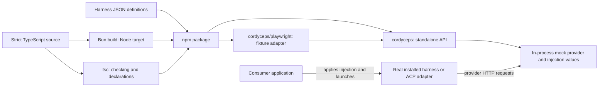

# Technology stack and distribution {#technology-stack}

Status: proposed technical design. This records the requested TypeScript, Bun, tsc and npm direction and develops its package/runtime boundaries. No package implementation, published artifact or passing runtime checks are claimed. The optional CLI and unresolved choices below remain proposals.



Bun is the development/build tool. Consumers import the resulting JavaScript into their Node application or test process. The consumer continues to own binary installation, discovery, invocation, shells and ACP client behavior.

## Stack and rationale {#stack-and-rationale}

| Area | Proposed choice | Purpose |
| --- | --- | --- |
| Language | TypeScript with strict checking | Typed public APIs, provider observations and injection definitions |
| Developer tooling | Bun package manager, scripts and unit test runner | One tool for routine development; commit its lockfile |
| JavaScript output | Bun bundler with the Node target | Produce distributable JavaScript from the TypeScript entry points |
| Types | tsc for checking and declaration emission | Publish declarations matching the public JavaScript exports |
| Consumer runtime | Node-compatible APIs | Installing Cordyceps does not require Bun or a TypeScript compiler |
| Package | One npm package | Share the core across standalone programs and Playwright fixtures |
| Mock backend | Node HTTP server in the calling process | Own listeners, routes and request lifetimes within each prepared mock |
| Configuration | JSON harness definitions; structured JSON/TOML output as needed | Keep injection data separate from provider codec code |

Bun supports a Node build target and leaves type checking and declaration generation to tsc. A Node target does not itself prove compatibility with a particular Node release: emitted syntax and runtime APIs still need checking against the selected minimum. See the [Bun bundler documentation](https://bun.sh/docs/bundler). TypeScript supports declaration-only output for builds that use another JavaScript transpiler; see [emitDeclarationOnly](https://www.typescriptlang.org/tsconfig/emitDeclarationOnly.html).

## Public entry points and ownership {#public-entry-points}

| Entry point | Responsibility | Dependency boundary |
| --- | --- | --- |
| `cordyceps` | Prepare mocks, register/load definitions, render injection, intercept/respond, observe provider traffic and dispose resources | No Playwright imports or fixture lifecycle required |
| `cordyceps/playwright` | Adapt the same core into test-scoped fixtures | Consumer supplies `@playwright/test` as an optional peer dependency |
| Optional CLI | Translate future command-line options into calls to the same core | No separate backend or harness runner; commands remain undefined |

These imports illustrate the proposed package exports; they are not currently executable package APIs:

```ts
// Proposed Cordyceps library export for your script or custom framework.
import { cordyceps } from 'cordyceps';
```

```ts
// Proposed Cordyceps fixture wrapper; expect is a Playwright assertion export.
import { test, expect } from 'cordyceps/playwright';
```

The Playwright entry point delegates preparation and disposal to the core. Its declarations and runtime imports may reference Playwright; importing the standalone entry point must not require it. Keep Playwright external to the bundle and mark its peer dependency optional. npm describes optional peers through `peerDependenciesMeta` in its [package metadata reference](https://docs.npmjs.com/cli/v11/configuring-npm/package-json/).

Consumer helpers such as `startMyApp`, frontend assertions and the ACP client facade remain application code. Cordyceps returns environment, argument and optional config-file values for those helpers to apply. Selecting an ACP recipe does not add an ACP implementation to this package or make the mock provider emit native ACP frames.

## Runtime and resource boundaries {#runtime-boundaries}

Use Node-compatible HTTP, filesystem, path and abort facilities in distributed runtime code. Bun-specific APIs may be used by development/build scripts and unit tests. The standalone core must not import `bun:test` or require `Bun.serve`.

Each prepared mock owns its listener, routing state, captured provider requests and generated configuration artifacts. Bind a loopback listener on an available port and return its derived injection settings. Disposal closes that listener, ends held request handlers and removes owned files; partial preparation releases resources already acquired. The application owns its processes and closes them through its usual lifecycle.

No hosted service, database, browser UI, native executable bundle or mandatory CLI process is required for the proposed library workflows. Local state stays with the prepared mock. Libraries used for schema validation or TOML serialization remain implementation choices, not new public API requirements.

## Build and npm artifact {#build-and-package}

Start with ESM output as the proposed package format. Keep root and Playwright exports explicit, with corresponding declaration paths. Whether CommonJS output is needed remains open; do not imply dual-format support without a consumer requirement and package checks.

The intended build pipeline is:

1. Install the locked development dependencies with Bun.
2. Run tsc with strict checking and stop on type errors.
3. Produce Node-targeted JavaScript with Bun and declarations with tsc; clean stale output before assembling a release.
4. Include the bundled harness definitions and any required schema/configuration assets. Resolve packaged files relative to the installed module, not the consumer's working directory.
5. Pack the JavaScript, declarations, required assets, package metadata, README and license into an npm tarball.
6. Verify that tarball in isolated consumer projects, then publish the verified artifact through the release workflow.

The proposed runtime dependency policy keeps Node built-ins and Playwright external. Ordinary runtime dependencies remain declared in package metadata and external initially; any later vendoring must be intentional. Do not accidentally bundle a second Playwright test runner. Publish no install hook that downloads AI binaries or invokes the consumer's shell setup.

The package export map, file allowlist and engine declaration must match the generated files. npm's [package metadata reference](https://docs.npmjs.com/cli/v11/configuring-npm/package-json/) describes these package controls. Exact scripts and output paths will be specified with the implementation; this document does not claim a working build command exists yet.

## Verification and release {#verification-and-release}

| Check | Intended evidence |
| --- | --- |
| Bun unit tests | Definition validation, token substitution, pure environment merging, configuration serialization and route matching |
| Synthetic provider exchanges | Request decoding, response/stream encoding, cancellation, isolation and cleanup using local fixtures |
| Packed artifact under Node | A clean consumer can import the root export, prepare a mock, send synthetic HTTP traffic and dispose it without Bun or Playwright installed |
| Packed artifact under Playwright | A clean consumer can import the fixture adapter, control mock responses and complete fixture teardown |
| Type consumer checks | Public imports and declarations resolve through the published export map for both entry points |
| Artifact inspection | Required JSON/config assets are included and private source/build-only files are excluded |

Run the package checks against the Node releases declared supported by Cordyceps before release. This is the library's runtime compatibility contract, separate from the explicitly excluded harness binary-version certification policy. Consumers decide which real-binary end-to-end tests their applications need. Bun-only passing tests do not establish Node compatibility.

Version and publish the single package after these checks. The npm name/scope, credentials or trusted-publishing setup and release automation must be configured before the first release. This design does not authorize or perform publication.

## Decisions still to make {#open-decisions}

- Minimum Node version and supported release range; pin Bun and TypeScript versions when scaffolding the project.
- Final npm name/scope and export names; `cordyceps` is the working package name used in the examples.
- Whether a concrete consumer needs CommonJS alongside the proposed ESM output.
- Whether a CLI is useful, and which commands justify it. Neither standalone programs nor Playwright fixtures depend on this decision.
- Validation/TOML packages and release automation, chosen when implementing the relevant boundary.

Provenance: the user proposed a simple TypeScript implementation built with Bun and tsc and published to npm, then requested this Change Saga design document. The Node-compatible library, optional Playwright entry point and possible thin CLI develop that direction while preserving the previously agreed consumer-owned process boundary. Package checks described here are planned verification, not completed results.
