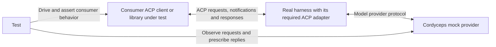

# Protocol consumers are a distinct integration surface {#protocol-consumers-are-a-distinct-integration-surface}

## Confirmed intent {#confirmed-intent}

The same developer persona needs to test an ACP application or library, with DevSwarm as the concrete intended consumer. The real harness participates. Its client-facing launch mode and message/lifecycle interface must be explicit; a plain-text invocation and an ACP connection are not interchangeable. This extends the earlier interactive/non-interactive stories with protocol-specific outcomes. The three new stories are proposed wording and criteria, not accepted scope or implemented functionality.

## Proposed API implications {#proposed-api-implications}

Keep **provider configuration** and **client interface** separate. Provider routing still controls model requests and responses. The client interface determines the required executable/adapter, arguments, transport, input types, output events and lifecycle. Preparation returns the selected definition’s environment, arguments and optional generated configuration. The consumer selects and launches its own binary or adapter. Cordyceps validates the definition only; it does not resolve executables, probe versions, manage shell startup or certify combinations.

The consumer's own protocol implementation stays in the test path. Cordyceps must not replace that implementation with its own client and then claim the consumer was tested. Protocol observation could use consumer instrumentation or a transparent transport observer; choosing and proving that mechanism remains design work. Backend request records alone do not reveal ACP initialization or session transitions.

An ACP session can complete a turn while its process and connection stay alive. Plain-text process-output assertions in the earlier usage slides remain examples of that launch mode only. ACP tests instead assert consumer state, messages and lifecycle outcomes. Client protocols need separate typed integration APIs; sharing a backend does not make the modes interchangeable.

## Native ACP contract {#native-acp-contract}

This is the user-confirmed consumer boundary: for a supported integration, the actual harness or ACP adapter emits messages conforming to the negotiated ACP specification. Consumers use their existing ACP client library and types. Cordyceps does not replace that wire contract with its own event vocabulary.

Protocol observation preserves the complete original message payload, including request/response identifiers, methods, parameters, results, errors, session identity and extension data when present. Observation metadata such as timestamps and direction belongs alongside the original message, not inside a rewritten payload. This is a semantic payload-preservation requirement; byte-for-byte capture is not specified. Provider API transcripts are a separate channel and must not be presented as ACP messages.

The real agent or adapter translates model-provider responses into ACP. Cordyceps scripts the model-facing behavior, while the client under test performs initialization, prompts, cancellation and applicable client-side handlers. Protocol version and capabilities come from actual negotiation, not a synthetic success inserted by the test library. A turn ends through its protocol response and stop reason, not by reading process exit.

## Proposed implementation responsibilities {#implementation-responsibilities}

| Part | Responsibility |
| --- | --- |
| Provider adapter and mock backend | Configure model routing, capture provider traffic and encode controlled model responses. |
| Injection preparation | Return the consumer-selected ACP recipe’s settings; the app owns executable selection, launch, transport and shell handling. |
| Consumer's ACP client | Own its real connection, negotiated protocol types, session state and handlers; this is the implementation being tested. |
| Optional protocol observer | Preserve native ACP payloads and direction separately from provider observations without claiming to replace the consumer client. |
| Test | Drive its consumer, prescribe provider responses, assert native messages and consumer state, and close consumer-owned processes before backend teardown. |

The preparation API should distinguish text/terminal invocation from ACP explicitly. ACP integration cannot be modeled as merely a different stdout string renderer. Standalone experiments use the consumer’s ordinary process and client APIs; no Cordyceps harness runner is required. Exact TypeScript names and the choice of consumer hooks versus a transparent transport observer remain proposed design work.

Consumer-owned end-to-end tests may exercise the real harness/adapter and the consumer's normal ACP implementation: negotiate, create a session, send a prompt, receive prescribed text through native ACP, exercise a tool and relevant client callbacks, observe prompt completion and cancellation, then tear down. Protocol conformance and original-payload preservation need explicit assertions. These are examples of consumer tests enabled by the mock provider, not a Cordyceps harness certification suite or binary-version support matrix. A provider mock cannot promise arbitrary ACP messages the real integration never emits; a directly scripted ACP peer or protocol-fault injector remains a separately scoped capability.

## Protocol boundaries {#protocol-boundaries}

ACP v1 defines initialization, session setup, prompt turns, updates and cancellation. Agents can also make permission and supported filesystem/terminal requests to the client. Accordingly, real tool execution can involve the consumer's own handlers; it is not universally an operation performed inside the agent process. See the [ACP overview](https://agentclientprotocol.com/protocol/v1/overview) and [initialization contract](https://agentclientprotocol.com/protocol/v1/initialization).

ACP's stdio transport carries JSON-RPC messages over stdin/stdout, with diagnostics on stderr. The distinction is structured protocol consumption versus rendered text, rather than the absence of stdout. See [ACP transports](https://agentclientprotocol.com/protocol/v1/transports).

JSON is an encoding, not a single client protocol. MCP defines a separate host/client/server relationship for tools and context; it is not automatically another ACP output format. Native JSON event streams and MCP use cases remain candidates. Their precise role and required integrations must be established before adding support obligations. See [MCP architecture](https://modelcontextprotocol.io/docs/2026-07-28/learn/architecture).

## Open scope {#open-scope}

The proposed baseline covers explicit launch mode, consumer message handling, initialization/session creation, turn completion and cancellation. Additional lifecycle scenarios such as reconnect, resume and version mismatch remain undecided. A real agent chooses its protocol messages and capabilities: forcing arbitrary malformed ACP messages or handshake failures would require a separate protocol-fault mechanism or mock peer. Provider response control alone does not promise those behaviors. No direct fake ACP peer is included by implication.

## Reading the lifecycle examples {#example-ownership}

All lifecycle snippets are illustrative consumer tests, not shipped Cordyceps helpers or verified integrations. `cordyceps`, `ai`, `route`, normalized provider request views and scripted response/stream controls are proposed Cordyceps APIs. `assert` refers to `node:assert/strict`; `expect` and `expect.poll` are Playwright assertions.

`connectClientUnderTest` and `exercise` come from the consumer’s own test helpers. The former applies injection values through the app’s existing setup, connects its real ACP client and owns process cleanup; the latter represents the consumer’s test body. `client.request`, `notify`, `onNotification`, `state`, `text`, `turnState`, `tools`, `tool` and `close` illustrate a consumer client facade. They are neither Cordyceps exports nor a prescribed ACP SDK interface. Substitute the actual methods of the client under test.

The method strings and wire payloads such as `session/prompt`, `session/update`, `session/cancel`, `stopReason` and permission outcomes belong to ACP. The real agent emits them. Sample session/request IDs illustrate correlation; tests use actual returned IDs. `offeredId` comes from the real permission request’s options. Fixture paths, setup objects, route markers and frontend locators are consumer-supplied test data. `Read` and `file_path` refer to an example harness tool schema, not ACP method names.

`deferred()` is a consumer utility returning `{ promise, resolve }`; `within(promise, milliseconds)` is a consumer utility that rejects when a wait exceeds the test deadline. Neither is a Cordyceps API. The snippets import them from an illustrative `./your-test-helpers` module. Teardown remains responsible for cleanup after a timeout.
