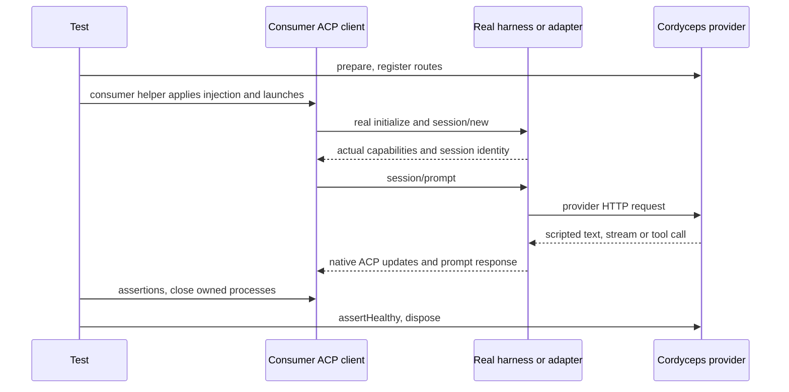

# Testing a real ACP consumer

For a runnable, pinned adapter integration against the packed npm artifact, see
[the real ACP example](real-acp.md). The guidance below applies to your own client.

Your actual client talks to the real harness or adapter. Cordyceps controls the separate provider HTTP boundary. It supplies an explicitly selected recipe's injection values and records only the observations your consumer submits. It does not implement ACP transport, negotiate capabilities, create sessions or manufacture protocol responses.

## Instrument native messages

Call `ai.recordProtocolMessage(direction, payload, metadata?)` at your existing client boundary. Direction is `client-to-agent` or `agent-to-client`. The complete native payload is snapshotted with observer metadata outside it. `ai.protocolMessages` and `ai.inputs` are consumer observations; `ai.requests` and `ai.responses` are provider HTTP observations. `recordInput` records input your consumer actually sent, rather than reconstructing it from a later provider request.

Do not assume provider request IDs or tool-call IDs equal ACP IDs. Record actual JSON-RPC IDs, session IDs, errors and extension fields intact. Optional observer metadata can identify your consumer connection or test case without changing the payload. This hook is passive; it does not replace the client under test or insert messages onto its transport.

## Exercise native lifetimes

The following are consumer scenarios, not bundled conformance tests. Use your actual ACP client APIs and the negotiated specification. `connectClientUnderTest`, `exercise`, `client.state`, `client.text`, `client.request`, `deferred` and `within` in the proposal decks are illustrative consumer helpers, not Cordyceps exports or prescribed SDK methods.

1. Launch through your application's own path using `ai.environment(baseEnv)`, `ai.args` and generated files. Initialize the real connection and create a session. Inspect the actual negotiated version/capabilities and returned session identity.
2. Register a text response, prompt through your client, and verify native updates and the terminal prompt response. A text chunk, tool completion, process exit and ACP turn completion are different events.
3. Gate an asynchronous provider stream between text segments. Assert incremental consumer output while the prompt is pending, then release your gate and await completion. The real adapter may buffer or rechunk; provider chunks are not promised ACP chunk boundaries.
4. Return a tool call matching the actual offered schema. Let the harness or normal consumer filesystem/terminal handlers execute it. Assert the actual follow-up provider result and native ACP tool updates. Exercise permission acceptance/refusal with options from the real agent's request.
5. Hold a provider route with `await route.untilAborted()`. Send cancellation through your real ACP client and use a bounded wait for its original prompt result. An HTTP abort is observable provider behavior, not proof that an ACP turn ended. If the agent does not cancel within the deadline, fail the scenario and close your processes.
6. Reuse the session after completion/cancellation and verify distinct sessions do not share consumer state. Load/resume/close/mode scenarios depend on actual negotiated support and remain consumer-owned.

Always release test-owned gates and close consumer-owned processes in `finally`, then dispose the mock. Provider errors can exercise a real agent's error mapping and retries. Arbitrary malformed ACP frames or forced handshake success would require a different test mechanism and are outside Cordyceps.

Definitions may declare an `acp` recipe, but that declaration is only data. It does not certify capabilities or choose an executable/adapter. Use a private definition when the bundled definition has no verified ACP recipe; a missing recipe fails explicitly.
